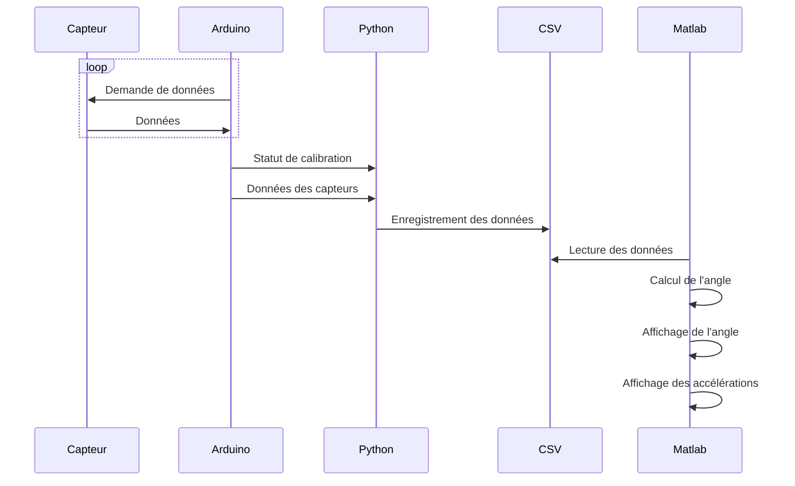

```mermaid
sequenceDiagram
    participant Capteur
    participant Arduino
    participant Python
    participant CSV
    participant Matlab

        
    loop
    Arduino->>Capteur: Demande de données
    Capteur->>Arduino: Données
    end

    Arduino->>Python: Statut de calibration
    Arduino->>Python: Données des capteurs
    Python->>CSV: Enregistrement des données


    Matlab->>CSV: Lecture des données
    Matlab->>Matlab: Calcul de l'angle
    Matlab->>Matlab: Affichage de l'angle
    Matlab->>Matlab: Affichage des accélérations

```
